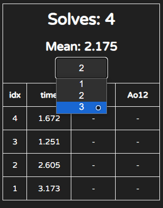

# HAC-Cube
> A cube timer project

### Use directly on [https://cube.hac.rf.gd](https://cube.hac.rf.gd)

---

### Features
- [x] Support ***2x2*** - ***7x7***, ***Pyraminx***, ***Megaminx***, ***Skewb***, ***Square-1***, ***Clock***
- [x] Support ***+2*** and ***DNF***
- [x] Draw Scramble

---

### Problem
if there's anything wrong
*(eg. something doesn't show up, css not working)*

it might because of your browser cache and the new updates

follow these steps: 
1. goto [chrome://settings/clearBrowserData](chrome://settings/clearBrowserData)
1. ONLY select **CACHE** then press clear
1. refresh HAC-Cube
1. press <kbd>ctrl+shift+p</kbd> then type `fix`
1. this should fix the problem
1. but if it's not, submit it to [Issues](https://github.com/GhostShadow0316/HAC-Cube/issues)

---

### !!! NEW FEATURE !!!
#### Keyboard Control
> press <kbd>ctrl+shift+p</kbd> to open up command palette

commands:
- `fix`: if there's any problem, try this command!
  

- `cube [cube]`: change cube

- `next`: next scramble

- `punish [+2/DNF]`: set punish to current solve (leave empty for clear punish)

- `view [index]`: view solve to no. ***[index]***

- `edit punish [index] [+2/DNF]`: set punish to solve no. ***[index]*** (leave empty for clear punish)

- `remove [idx]`: remove solve no. ***[index]***

- `copy`
    - `scramble` or `sc`: copy current scramble

    - `time`: copy current solve time

---

### !!! NEW FEATURE !!!
#### Sessions
> Save your solves in different sessions

now there's a drop down menu to switch different sessions

or you can use the command:
- `session change [session]` or `session = [session]`

---

   

latest update on 2023-11-20
